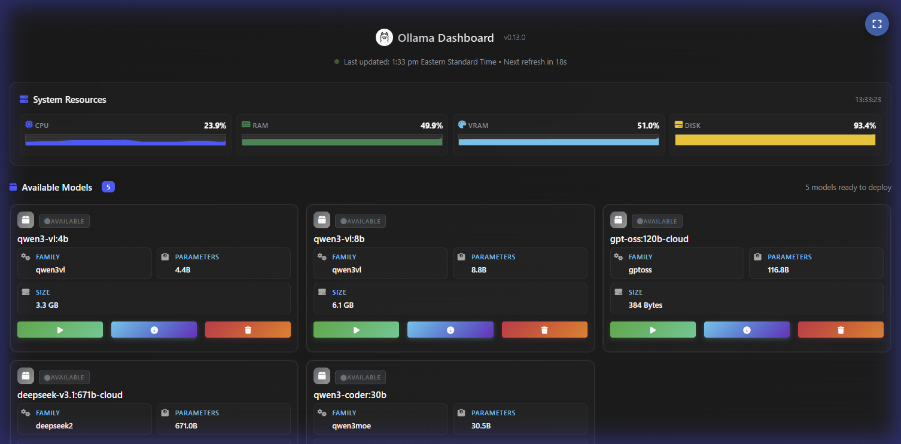

# Ollama Dashboard

A lightweight, personal dashboard for monitoring your locally running Ollama models. Built with Flask and designed for simplicity.



## Purpose

Ollama Dashboard provides a clean, minimal web interface to:

 - View all your running Ollama models in one place
 - Monitor model details like family, parameters, and quantization
 - Track model sizes and expiration times
 - View historical model usage
 - Auto-refresh every 30 seconds to keep information current

## Features

- 🎯 Simple, single-purpose design
- 🔄 Auto-refreshing dashboard
- 🎨 Dark mode interface
- 📱 Responsive layout
- 🕒 Real-time status indicators
- 0️⃣ Zero configuration needed
- 🐳 Docker support
- 🤖 Model management (start/stop/delete)
- 📊 System performance monitoring
- 🔧 Service management controls
- 🧠 Dynamic capability icons (vision detection)
- 🚀 Warm start endpoint to pre-load models and avoid first-call socket errors

### Dashboard Features

- Real-time model status monitoring
- Detailed model information including:
  - Model family and version
  - Parameter size
  - Quantization level
  - Model size (adaptive units)
  - Expiration time (when applicable)
- Status indicator showing Ollama connection state
- Clear error messages when Ollama is not running

### Model Management

- Start/stop models with one click
- Delete unused models
- Automatic model downloading if needed
- Model compatibility checking
- Real-time loading status

### System Monitoring

- CPU, memory, and VRAM usage
- Disk space monitoring
- Real-time performance metrics

## Warm Start & Capabilities

Some larger or multimodal models can trigger a "forcibly closed" socket error the first time they are used after download. To mitigate this the dashboard now performs an optional warm start sequence:

1. Download model via `POST /api/models/pull/<model>`.
2. Optionally call `POST /api/models/start/<model>` which issues a trivial generate request and keeps the model alive.
3. The start endpoint retries transient connection reset / forcibly closed / timeout errors up to 3 times.

Vision capability is detected if:
* Model name matches one of: `llava`, `bakllava`, `llava-llama3`, `llava-phi3`, `moondream`
* Backend metadata sets `has_vision: true`
* Families include projector / clip related indicators

The frontend renders capability icons dynamically (implemented in `app/static/js/main.js`). Reasoning and tool usage icons are placeholders for future expansion.

Manual warm start example:
```bash
curl -X POST http://127.0.0.1:5000/api/models/start/llava
```

## Prerequisites

- Python 3.x (for local installation)
- Docker (for containerized installation)
- Ollama running locally

## Installation Options

### Option 1: Local Installation

1. Clone the repository:

```bash
git clone https://github.com/BazoukaJo/ollama-dashboard.git
cd ollama-dashboard
```

2. Install dependencies:

```bash
pip install -r requirements.txt
```

3. Run the dashboard:

```bash
python wsgi.py
```

### Option 2: Docker Installation (Recommended)

1. Clone the repository:

```bash
git clone https://github.com/BazoukaJo/ollama-dashboard.git
cd ollama-dashboard
```

2. Build and run using the provided script:

```bash
./scripts/build.sh
```

### Option 3: Auto-Start Scripts (Windows)

For automatic management of the dashboard based on Ollama status:

#### Service Installation (Recommended)
```powershell
# Install as a Windows service (requires Administrator)
.\scripts\ollama-dashboard-monitor.ps1 -Install

# Check status
.\scripts\ollama-dashboard-monitor.ps1 -Status
```

#### Manual Monitoring
```powershell
# PowerShell monitor
.\scripts\start-with-ollama.ps1 -Monitor

# Simple batch monitor
scripts\start-with-ollama.bat
```

The dashboard will be available at http://127.0.0.1:5000

## Configuration

The dashboard can be configured using environment variables:

- `OLLAMA_HOST`: Ollama server host (default: localhost)
- `OLLAMA_PORT`: Ollama server port (default: 11434)
- `MAX_HISTORY`: Maximum number of history entries to keep (default: 50)
- `HISTORY_FILE`: Path to history file (default: history.json)

When running with Docker, these are pre-configured in the `docker-compose.yml` file.

## Troubleshooting

### Common Issues

1. **403 Forbidden Error**
   - Ensure Ollama is running on your host machine
   - Check that port 11434 is accessible
   - Verify your firewall settings allow the connection

2. **Connection Errors**
   - When using Docker, the dashboard uses `host.docker.internal` to connect to Ollama
   - Ensure Ollama is running before starting the dashboard
   - Check the Ollama logs for any connection issues

3. **Static Files Not Loading**
   - Clear your browser cache
   - Try accessing the dashboard using 127.0.0.1 instead of localhost

### Testing Routes

The dashboard includes test routes to preview different states:

- `/test/no-models` - Preview empty state
- `/test/error` - Preview error state when Ollama isn't running
- `/test/with-models` - Preview dashboard with sample models

## Testing

The project includes comprehensive tests to ensure functionality:

### Running Tests

```bash
# Run all tests (pytest)
python -m pytest -q

# Run specific test file
python -m pytest tests/test_capabilities_pytest.py::test_all_downloadable_models_include_vision_flags -q

# Run with coverage
python -m pytest --cov=app --cov-report=html
```

### Test Files

- `tests/test_ollama_service.py` - Core Ollama service functionality
- `test_api.py` - API endpoint testing
- `test_chat_models.py` - Chat model integration tests
- `test_disk.py` - Disk usage and storage tests
- `test_models.py` - Model management tests
- `tests/test_start_model_pytest.py` - Warm start endpoint tests
- `tests/test_capabilities_pytest.py` - Capability detection & metadata tests

## Project Structure

```
ollama-dashboard/
├── app/                          # Main application
│   ├── routes/                   # Flask routes
│   ├── services/                 # Business logic services
│   ├── static/                   # CSS, JS, images
│   └── templates/                # HTML templates
├── docker/                       # Docker configuration
├── scripts/                      # Auto-start and utility scripts
├── tests/                        # Test suite
├── requirements.txt              # Python dependencies
├── wsgi.py                       # Application entry point
└── README.md                     # This file
```

## Note

This is a personal utility tool designed for individual use. It's intentionally kept simple and assumes Ollama is running on the same machine. Perfect for developers who want a quick visual overview of their currently running Ollama models.

## Accessing the Dashboard

The dashboard is available at:
- Web Interface: http://127.0.0.1:5000

Note: Please use the IP address (127.0.0.1) rather than localhost to access the dashboard.
