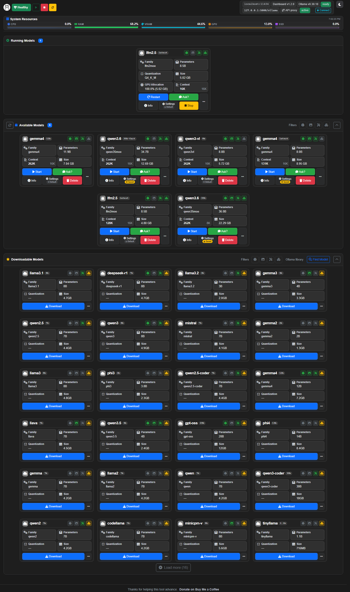

# Ollama Dashboard

## Version 1.0003



A web dashboard for monitoring, controlling, and managing Ollama language models: real-time system metrics, per-model settings with JSON persistence, and model discovery.

---

## Features

### Core Functionality

- **Model Management**: Start, stop, restart, delete, and download Ollama models
- **Per-Model Settings**: Temperature, top-k, penalties with atomic JSON persistence
- **System Monitoring**: Real-time CPU, RAM, VRAM (GPU), and GPU Utilization usage
- **Service Control**: Start/stop/restart Ollama service (multi-platform)
- **Model Discovery**: Browse and download from the Ollama library

### User Interface

- **Dark / light themes**: Toggle in the header; tokens in `theme.css`
- **Responsive layout**: Mobile-friendly controls and card grids
- **Real-time metrics**: System stats and health; model lists refresh from the UI (no background model-list polling)
- **Capability icons**: Reasoning, vision, and tools on each card when known
- **Settings status**: Each **Settings** control shows a small **Saved** (custom JSON) or **Default** (recommended / built-in) badge
- **Compact mode**: Optional; the floating toggle is not in `index.html` by default. See **[docs/UI.md](docs/UI.md)** to add it or change downloadable-model pagination

---

## Quick Start

### Prerequisites

- Python 3.8 or higher
- Ollama running on localhost:11434

### Windows

```bash
# Clone repository
git clone https://github.com/bazoukajo/ollama-dashboard.git
cd ollama-dashboard

# Create virtual environment and install
python -m venv .venv
.venv\Scripts\activate
pip install -r requirements.txt

# Run (production)
start_app.bat

# Open in browser: http://localhost:5000
```

### Linux / macOS

```bash
git clone https://github.com/bazoukajo/ollama-dashboard.git
cd ollama-dashboard
pip install -r requirements.txt
python OllamaDashboard.py
# Open in browser: http://localhost:5000
```

### Docker

```bash
docker build -t ollama-dashboard .
docker run -p 5000:5000 \
  -e OLLAMA_HOST=host.docker.internal \
  ollama-dashboard:latest
```

### Docker Compose

```bash
docker-compose up -d
# Access at http://localhost:5000
```

### Run at Windows startup

To start the dashboard when Windows starts, copy `StartupFolder\Start Ollama Dashboard.bat` into the Startup folder. Open the folder with **Win+R** → `shell:startup` → Enter. See `StartupFolder\README.txt` for the exact path.

---

## Documentation

- **[Architecture Guide](docs/ARCHITECTURE.md)** — Service composition, data flow, caching strategy
- **[Deployment Guide](docs/DEPLOYMENT.md)** — Windows, Docker, Gunicorn + Nginx
- **[Security Guide](docs/SECURITY.md)** — Validation, CORS, TLS, secrets management

---

## Architecture

```text
┌──────────────────────────────────────────┐
│         Ollama Dashboard                  │
├──────────────────────────────────────────┤
│ Flask Web Framework (HTTP routing)        │
│ + CORS, Security Headers                │
├──────────────────────────────────────────┤
│ Route Layer (API endpoints)               │
│ + Input validation, Serialization        │
├──────────────────────────────────────────┤
│ OllamaService (Main Orchestrator)        │
│ ├─ OllamaServiceCore (caching, bg)      │
│ ├─ OllamaServiceModels (operations)     │
│ ├─ OllamaServiceControl (service mgmt)  │
│ └─ OllamaServiceUtilities (settings)    │
├──────────────────────────────────────────┤
│ HTTP Client (requests.Session)            │
│ + Connection pooling, Keep-alive         │
├──────────────────────────────────────────┤
│ Ollama API (localhost:11434)              │
│ /api/ps, /api/tags, /api/generate, etc.  │
└──────────────────────────────────────────┘
```

---

## Configuration

Configuration via environment variables:

```bash
OLLAMA_HOST=localhost              # Ollama hostname
OLLAMA_PORT=11434                  # Ollama port

HISTORY_FILE=history.json          # Chat history file
MODEL_SETTINGS_FILE=model_settings.json
MAX_HISTORY=50                     # Max history entries

LOG_LEVEL=INFO                     # Logging level
```

Create a `.env` file with your settings; defaults work out-of-the-box for local use.

---

## Background Updates

The service runs a background thread for:

| Data         | Interval | Notes                                                   |
| ------------ | -------- | ------------------------------------------------------- |
| System stats | 1s       | CPU, RAM, VRAM; cached for `/api/system/stats` (5s TTL) |
| Health ping  | ~15s     | Lightweight Ollama check for `/api/health` recovery     |

**Model list** (running and available) is **not** polled in the background; it is fetched when you load the page or click **Refresh**. The frontend polls system stats every 1s and health every 15s.

The background thread is automatically managed and restarts on crash.

---

## Development

### Testing

```bash
# Run all tests
python -m pytest -q

# Run specific test
python -m pytest tests/test_start_model_pytest.py::test_start_model_success -q

# Coverage report
python -m pytest --cov=app --cov-report=html
```

### Workflow

```bash
# After editing service/routes/UI:
1. python -m pytest -q
2. Restart the app
3. Test in browser: http://localhost:5000
```

---

## Troubleshooting

### Models show as "running" or "available" but list is wrong

- Click the **Refresh** button (next to "Available Models" or in the top bar) to refetch the model list
- Reload the page if needed

### Settings changes not persisting

- Check `model_settings.json` file permissions
- Ensure app directory is writable

### Slow response times

- Check Ollama status: `curl http://localhost:11434/api/ps`
- Monitor system resources (CPU, RAM, VRAM, GPU 3D)

See [Architecture Guide](docs/ARCHITECTURE.md) for more troubleshooting.

---

## Dependencies

```text
Flask==3.0.0           # Web framework
flask-cors==4.0.0      # CORS support
waitress==3.0.2        # Production WSGI server (Windows)
requests==2.31.0       # HTTP client
psutil==5.9.6          # System stats
pytz==2023.3           # Timezone support
```

Optional (for GPU monitoring):

```text
nvidia-ml-py           # VRAM monitoring (NVIDIA GPUs)
GPUtil                 # Alternative GPU stats
```

Docker uses Gunicorn (Linux) via `wsgi.py`; Windows bat files use Waitress.

---

## License

MIT License - See [LICENSE](LICENSE) for details.

---

## Contributing

Contributions welcome! Please:

1. Fork the repository
2. Create feature branch: `git checkout -b feature/amazing-thing`
3. Add tests for new functionality
4. Ensure tests pass: `python -m pytest -q`
5. Submit pull request

---

## Support

- **Issues**: [GitHub Issues](https://github.com/bazoukajo/ollama-dashboard/issues)
- **Documentation**: [docs/](docs/)
- **Community**: [Ollama Discord](https://discord.gg/ollama)

### Donate

If this project helps you, you can support ongoing development here:

- [Buy Me a Coffee](https://buymeacoffee.com/bazoukajo)

Thanks for helping this tool keep advancing.
