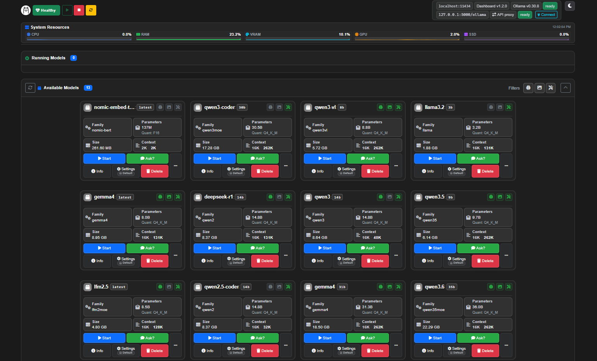

# Ollama Dashboard

## Version 1.1.0



A web dashboard for monitoring, controlling, and managing Ollama language models: real-time system metrics, per-model settings with JSON persistence, and model discovery.

---

## Features

### Core Functionality

- **Model Management**: Start, stop, restart, delete, and download Ollama models
- **Per-Model Settings**: Temperature, top-k, penalties with atomic JSON persistence. By default these are applied only to requests made *through the dashboard* (chat, warm-load, restart) — see [Per-Model Settings: scope and limitations](#per-model-settings-scope-and-limitations) for how to make them apply to external clients (e.g. VS Code) too.
- **System Monitoring**: Real-time CPU, RAM, VRAM (GPU), and GPU Utilization usage
- **Service Control**: Start/stop/restart Ollama service (multi-platform)
- **Model Discovery**: Browse and download from the Ollama library

### User Interface

- **Dark / light themes**: Toggle in the header; tokens in `theme.css`
- **Responsive layout**: Mobile-friendly controls and card grids
- **Real-time metrics**: System stats and health; model lists refresh from the UI (no background model-list polling)
- **Capability icons**: Reasoning, vision, and tools on each card when known
- **Settings status**: Each **Settings** control shows a small **Saved** (custom JSON) or **Default** (recommended / built-in) badge

---

## Quick Start

### Prerequisites

- Python 3.8 or higher
- Ollama running on localhost:11434

### Windows

```bash
# Clone repository
git clone https://github.com/bazoukajo/ollama-dashboard.git
cd ollama-dashboard

# Create virtual environment and install
python -m venv .venv
.venv\Scripts\activate
pip install -r requirements.txt

# Run (production)
start_app.bat

# Open in browser: http://localhost:5000
```

### Linux / macOS

```bash
git clone https://github.com/bazoukajo/ollama-dashboard.git
cd ollama-dashboard
pip install -r requirements.txt
python OllamaDashboard.py
# Open in browser: http://localhost:5000
```

### Install from PyPI (when published) or from a wheel

```bash
pip install ollama-dashboard
ollama-dashboard
# http://127.0.0.1:5000 — override host/port with OLLAMA_DASHBOARD_HOST / OLLAMA_DASHBOARD_PORT
```

Build a wheel from a git checkout:

```bash
pip install build
python -m build
# dist/ollama_dashboard-<version>-py3-none-any.whl
pip install dist/ollama_dashboard-*-py3-none-any.whl
ollama-dashboard
```

### Docker

```bash
docker build -t ollama-dashboard .
docker run -p 5000:5000 \
  -e OLLAMA_HOST=host.docker.internal \
  ollama-dashboard:latest
```

### Docker Compose

```bash
docker-compose up -d
# Access at http://localhost:5000
```

### Run at Windows startup

To start the dashboard when Windows starts, copy `StartupFolder\Start Ollama Dashboard.bat` into the Startup folder. Open the folder with **Win+R** → `shell:startup` → Enter. See `StartupFolder\README.txt` for the exact path.

---

## Documentation

- **[Architecture Guide](docs/ARCHITECTURE.md)** — Service composition, data flow, caching strategy
- **[Deployment Guide](docs/DEPLOYMENT.md)** — Windows, Docker, Gunicorn + Nginx
- **[Security Guide](docs/SECURITY.md)** — Validation, CORS, TLS, secrets management
- **[Troubleshooting](docs/TROUBLESHOOTING.md)** — Empty running list, settings/API errors, Ollama host, logging
- **[Contributing](CONTRIBUTING.md)** — Tests, Ruff lint, PR checklist

---

## Architecture

```text
┌──────────────────────────────────────────┐
│         Ollama Dashboard                  │
├──────────────────────────────────────────┤
│ Flask Web Framework (HTTP routing)        │
│ + CORS, Security Headers                │
├──────────────────────────────────────────┤
│ Route Layer (API endpoints)               │
│ + Input validation, Serialization        │
├──────────────────────────────────────────┤
│ OllamaService (Main Orchestrator)        │
│ ├─ OllamaServiceCore (caching, bg)      │
│ ├─ OllamaServiceModels (operations)     │
│ ├─ OllamaServiceControl (service mgmt)  │
│ └─ OllamaServiceUtilities (settings)    │
├──────────────────────────────────────────┤
│ HTTP Client (requests.Session)            │
│ + Connection pooling, Keep-alive         │
├──────────────────────────────────────────┤
│ Ollama API (localhost:11434)              │
│ /api/ps, /api/tags, /api/generate, etc.  │
└──────────────────────────────────────────┘
```

---

## Per-Model Settings: scope and limitations

Per-model settings (temperature, top-k, top-p, context size, penalties, stop sequences, etc.)
are saved to `model_settings.json` (see [Configuration](#configuration)). **By default, these
settings are applied only to requests that the dashboard itself sends to Ollama** — its chat
UI, and the warm-load/restart/bulk-start "options" payloads (`app/routes/main.py`, e.g. the
`/api/models/start`, `/api/models/restart`, `/api/models/bulk/start`, and `/api/chat` handlers).

Ollama applies the `options` field strictly per HTTP request; it does not remember them for a
model afterwards. That means **any other client that talks to Ollama directly — the VS Code
Ollama extension, `ollama run`, `curl`, LangChain, etc. — will use Ollama's own defaults (or
whatever is baked into the model's `Modelfile`), not the values you saved here.** This is by
design (per-request `options` is the documented Ollama API behavior), but it surprises users
who expect "saved settings" to follow the model everywhere.

### Recommended: point external clients at the dashboard's built-in proxy (`/ollama/api/...`)

The dashboard itself exposes a settings-injecting proxy — no extra process required. Routes
registered in `app/__init__.py` (`intercept_ollama_parameters` /
`proxy_general_ollama_calls`) sit in front of Ollama: every `/ollama/api/chat` and
`/ollama/api/generate` request is read, your saved `model_settings.json` entry for that model
is merged into its `options` (your saved values win over whatever the client sent), and the
rewritten request is forwarded to Ollama and streamed back; everything else under
`/ollama/api/...` (tags, show, pull, etc.) passes straight through untouched.

Point your external client's base URL at the dashboard host **plus `/ollama`** instead of
Ollama's `:11434` directly — e.g. for VS Code extensions that take an `apiBase`
(such as Continue's `config.json`):

```jsonc
{ "models": [{ "title": "Ollama Pro", "provider": "ollama", "model": "qwen3.5:9b",
               "apiBase": "http://localhost:5000/ollama" }] }
```

`ollama run` / other CLI tools can be pointed here too via `OLLAMA_HOST=localhost:5000/ollama`
(where supported). Original model names are kept, and **every** saved option is applied
exactly — including `presence_penalty`, `frequency_penalty`, `typical_p`, and
`penalize_newline`, which can't be expressed in a Modelfile (see below). This only intercepts
the two inference endpoints; CORS for `/ollama/*` is opened to any origin so IDE extensions
running from `vscode-webview://` etc. can reach it.

### Alternative: "Bake into Model" (for `ollama run` / clients you can't repoint)

If you can't change a client's base URL (e.g. plain `ollama run` from a terminal, or a tool
with no configurable endpoint) but want your saved values to follow a specific model, open
its **Settings** dialog and click **Bake into Model**. This calls `POST
/api/models/settings/<model>/bake`, which:

1. Generates a `Modelfile` with `FROM <model>` plus one `PARAMETER <key> <value>` line per
   saved setting that Ollama's Modelfile format supports (temperature, top_k, top_p, num_ctx,
   seed, num_predict, repeat_last_n, repeat_penalty, mirostat*, min_p, stop, etc.).
2. Calls Ollama's `/api/create` to build a new, derived model — named `<model>-dashboard`
   (e.g. `llama3-dashboard:8b`) — with those parameters baked in.

Run/reference the derived model name to get your saved defaults automatically — no proxy or
running dashboard required. Note that `presence_penalty`, `frequency_penalty`, `typical_p`,
and `penalize_newline` are **not** valid Modelfile `PARAMETER` directives, so they can't be
baked in this way (they're silently omitted from the generated `Modelfile`).

### Alternative: standalone proxy (`server_with_proxy.js`)

Functionally equivalent to the built-in `/ollama/api/...` proxy above, but runs as an
independent Node process — useful if you want settings injection available even when the
Flask dashboard isn't running, or prefer not to route inference traffic through it. Reads the
**same** `model_settings.json`:

```bash
npm install        # installs express + http-proxy-middleware
npm run proxy      # starts the proxy on http://localhost:11435 by default
```

Then point external clients at `http://localhost:11435` instead of Ollama's `:11434` (no
`/ollama` suffix needed — it mirrors Ollama's API directly at its root). Configure with env
vars (`OLLAMA_HOST`, `OLLAMA_PORT`, `MODEL_SETTINGS_FILE`, `PROXY_PORT`) if your setup differs
— see the comments at the top of `server_with_proxy.js`.

#### Zero-config variant: take over Ollama's default port

Repointing every client individually is tedious. Because this proxy mirrors Ollama's API at
its own root — unlike the dashboard's built-in proxy, which needs the `/ollama` prefix and so
can't do this — it can stand in for Ollama *at Ollama's own default address*. Every client that
already assumes Ollama lives at `localhost:11434` (VS Code extensions, `ollama run`, curl,
LangChain, ...) then gets your saved settings transparently, with **no client-side
configuration at all**:

1. **Relocate the real Ollama** off `:11434` — set `OLLAMA_HOST=127.0.0.1:11436` (Ollama's own
   combined `host:port` form for this variable) in the environment that *launches Ollama*, then
   restart Ollama so it picks up the change and starts listening on `:11436` instead.
2. **Run this proxy on the now-vacated `:11434`**, pointed at the relocated Ollama. On Windows,
   `start_proxy_takeover.bat` does both for you — sets `PROXY_PORT=11434` and runs `npm run
   proxy`, with pre-flight checks and guidance printed to the console. Manually: `set
   PROXY_PORT=11434&& set OLLAMA_HOST=127.0.0.1:11436&& npm run proxy`.

Using the combined `host:port` form means the **same** `OLLAMA_HOST` value configures Ollama,
the dashboard, *and* this proxy identically — all three split an embedded port out of
`OLLAMA_HOST` the same way (`_get_ollama_host_port()` /
`_normalize_ollama_host_port_for_display()` in the Python app, `resolveOllamaHostPort()` in
`server_with_proxy.js`), so there's nothing left to reconcile by hand.

To revert: stop the proxy, point `OLLAMA_HOST` back at Ollama's default (or remove the
override) and restart Ollama — it resumes listening on `:11434` directly, and every client
reaches it unchanged again (without saved-settings injection).

---

## Configuration

Configuration via environment variables:

```bash
OLLAMA_HOST=localhost              # Ollama hostname
OLLAMA_PORT=11434                  # Ollama port
AUTO_START_OLLAMA=true             # Start Ollama automatically if not already running

HISTORY_FILE=history.json          # Chat history file
MODEL_SETTINGS_FILE=model_settings.json
MAX_HISTORY=50                     # Max history entries

LOG_LEVEL=INFO                     # Logging level
```

`OLLAMA_HOST` may also be given in the combined `host:port` form — e.g.
`OLLAMA_HOST=127.0.0.1:11436` — which is the convention Ollama's *own* `OLLAMA_HOST` uses. An
embedded port wins over `OLLAMA_PORT`. This is normalized consistently everywhere the
dashboard talks to Ollama (including the `/ollama/api/...` proxy), so the same value also
configures `server_with_proxy.js`; see [Per-Model Settings: scope and
limitations](#per-model-settings-scope-and-limitations) for the deployment this enables.

`AUTO_START_OLLAMA` (default `true`) makes the dashboard check, on its own startup, whether
Ollama is already running — and start it itself if not, in a background thread so it never
delays the dashboard coming up. It tries (in order) the Windows `Ollama` service, common
install paths, then `ollama`/`ollama.exe serve` directly — see `_auto_start_ollama` /
`start_service` in `app/services/ollama_core.py` / `ollama_service_control.py`. This is the
*opposite direction* from `scripts/ollama-dashboard-monitor.ps1` (which watches **Ollama** and
starts/stops the **dashboard** accordingly — see [Deployment Guide](docs/DEPLOYMENT.md)). Set
`AUTO_START_OLLAMA=false` if you'd rather always start Ollama yourself or via your own process
manager.

Create a `.env` file with your settings; defaults work out-of-the-box for local use.

---

## Background Updates

The service runs a background thread for:

| Data         | Interval | Notes                                                   |
| ------------ | -------- | ------------------------------------------------------- |
| System stats | 1s       | CPU, RAM, VRAM; cached for `/api/system/stats` (5s TTL) |
| Health ping  | ~15s     | Lightweight Ollama check for `/api/health` recovery     |

**Model list** (running and available) is **not** polled in the background; it is fetched when you load the page or click **Refresh**. The frontend polls system stats every 1s and health every 15s.

The background thread is automatically managed and restarts on crash.

---

## Development

### Testing

```bash
# Run all tests
python -m pytest -q

# Lint (same as CI lint job)
pip install ruff && ruff check app tests scripts

# Optional: same checks as tests/test_smoke_script.py (also run by pytest)
python scripts/smoke_check.py

# Run specific test
python -m pytest tests/test_start_model_pytest.py::test_start_model_success -q

# Coverage report
python -m pytest --cov=app --cov-report=html
```

CI runs `pytest -q` on Ubuntu and Windows; smoke checks run inside pytest via `tests/test_smoke_script.py` (see `.github/workflows/ci.yml`).

### Workflow

```bash
# After editing service/routes/UI:
1. python -m pytest -q
2. Restart the app
3. Test in browser: http://localhost:5000
```

---

## Troubleshooting

### Models show as "running" or "available" but list is wrong

- Click the **Refresh** button (next to "Available Models" or in the top bar) to refetch the model list
- Reload the page if needed

### Settings changes not persisting

- Check `model_settings.json` file permissions
- Ensure app directory is writable

### My saved parameters aren't used by VS Code / `ollama run` / other external tools

This is expected — see [Per-Model Settings: scope and limitations](#per-model-settings-scope-and-limitations).

### Slow response times

- Check Ollama status: `curl http://localhost:11434/api/ps`
- Monitor system resources (CPU, RAM, VRAM, GPU 3D)

See [Architecture Guide](docs/ARCHITECTURE.md) for more troubleshooting.

---

## Dependencies

```text
Flask==3.0.0           # Web framework
flask-cors==4.0.0      # CORS support
waitress==3.0.2        # Production WSGI server (Windows)
requests==2.31.0       # HTTP client
psutil==5.9.6          # System stats
pytz==2023.3           # Timezone support
```

Optional (for GPU monitoring):

```text
nvidia-ml-py           # VRAM monitoring (NVIDIA GPUs)
GPUtil                 # Alternative GPU stats
```

Docker uses Gunicorn (Linux) via `wsgi.py`; Windows bat files use Waitress.

---

## License

MIT License - See [LICENSE](LICENSE) for details.

---

## Contributing

Contributions welcome! Please:

1. Fork the repository
2. Create feature branch: `git checkout -b feature/amazing-thing`
3. Add tests for new functionality
4. Ensure tests pass: `python -m pytest -q`
5. Submit pull request

---

## Support

- **Issues**: [GitHub Issues](https://github.com/bazoukajo/ollama-dashboard/issues)
- **Documentation**: [docs/](docs/)
- **Community**: [Ollama Discord](https://discord.gg/ollama)

### Donate

If this project helps you, you can support ongoing development here:

- [Buy Me a Coffee](https://buymeacoffee.com/bazoukajo)

Thanks for helping this tool keep advancing.
